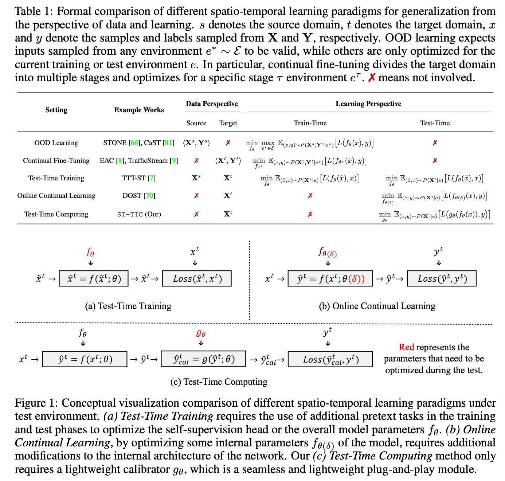

<div align="center">
  <h2><b><big>(NeurIPS'25 Spotlight) - 🌠 ST-TTC</big> <br><br> Learning with Calibration: Exploring <u>T</u>est-<u>T</u>ime <u>C</u>omputing of <u>S</u>patio-<u>T</u>emporal Forecasting </b></h2>
</div>

<div align="center">


[](https://GitHub.com/Naereen/StrapDown.js/graphs/commit-activity)
[](http://makeapullrequest.com)

</div>

<div align="center">

> ⭐ ST-TTC is a method for exploring the **real-time calibration** of models in the face of open environment **dynamic spatio-temporal distribution shifts** during the **Test-Time Computing Phase**.

**[<a href="https://arxiv.org/pdf/2506.00635">Paper Page</a>]**
<!-- **[<a href="./asset/EAC_presentation.pdf">Presentation Slide</a>]** -->

<!-- By [Citymind LAB](https://citymind.top) , [HKUST(GZ)](https://www.hkust-gz.edu.cn/) . -->


</div>

<!-- ## Todo List:

- [ ] We plan to release a spatio-temporal foundation model (much more advanced than what we have now) in the coming months, so stay tuned! 🤫 -->


## Updates/News:

<!-- 🚩 **News** (Jun. 2025): We have fixed the problem of not being able to use direct inference with weights. 💉

🚩 **News** (Apr. 2025): We upload all processed complete datasets to the [cloud disk](https://hkustgz-my.sharepoint.com/:f:/g/personal/wchen110_connect_hkust-gz_edu_cn/EuiKtt95qnpNgOngXAV_MmABWYyEBh74ooM94kdycwg4Sw?e=ZRCC1n), and you can download them directly to avoid the difficulty of reproducing the processing problems! 😊

🚩 **News** (Feb. 2025): EAC's code, data, weights, and training logs are fully open source! Try to improve on this! 😊 -->

🚩 **News** (Sep. 2025): ST-TTC has been accpeted by NeurIPS 2025 with Spotlight! ✅


## 📖 Introduction

Spatio-temporal forecasting is crucial in many domains, such as transportation, meteorology, and energy. However, real-world scenarios frequently present challenges such as signal anomalies, noise, and distributional shifts. Existing solutions primarily enhance robustness by modifying network architectures or training procedures. Nevertheless, these approaches are computationally intensive and resource-demanding, especially for large-scale applications. In this paper, we explore a novel test-time computing paradigm, namely learning with calibration, ST-TTC, for spatio-temporal forecasting. Through learning with calibration, we aim to capture periodic structural biases arising from non-stationarity during the testing phase and perform real-time bias correction on predictions to improve accuracy. Specifically, we first introduce a spectral-domain calibrator with phase-amplitude modulation to mitigate periodic shift and then propose a flash updating mechanism with a streaming memory queue for efficient test-time computation. ST-TTC effectively bypasses complex training-stage techniques, offering an efficient and generalizable paradigm. Extensive experiments on real-world datasets demonstrate the effectiveness, universality, flexibility and efficiency of our proposed method.

<p align="center">
    
</p>


<!-- ## 📚 Training Data

[Important]: Now, the processed dataset can be directly accessed from the [cloud disk](https://hkustgz-my.sharepoint.com/:f:/g/personal/wchen110_connect_hkust-gz_edu_cn/EuiKtt95qnpNgOngXAV_MmABWYyEBh74ooM94kdycwg4Sw?e=ZRCC1n)!

Our datasets are available on [Google Drive](https://drive.google.com/drive/folders/1OiMLuFBdc56CLekileRjH0xyhDWuoC6C?usp=drive_link).

Please download all processed datasets and place them in the [data folder](./data). -->

<!-- ## 🚀 Getting Started

### Installation

1. Please install the core dependencies, including:

```shell
python = 3.8.5
pytorch = 1.7.1
torch-geometric = 1.6.3
```

2. Or you can directly create and import a ready-made environment:

```shell
conda env create -f environment.yaml
conda activate stg
```

### Usages

1. You can run a specific method on a specific dataset separately, for example, run the EAC method on the PEMS-Stream dataset:

```python
python main.py --conf conf/PEMS/eac.json --gpuid 0 --seed 43
```

2. Or you can run the script to batch execute all baseline methods on a specified dataset, for example, run all baseline methods on the PEMS-Stream dataset:

```shell
sh scripts/pems_run.sh
``` -->

## Summary of experimental codes for all different scenarios and settings.

+ **Large-Scale Scenario**: The experimental code for some settings of RQ2 in this article is in the [large_scale_scenario](./large_scale_scenario) file. Please refer to the [README.md](./large_scale_scenario/README.md) in the folder for related experiments.

+ **Small-Scale Scenario**: The experimental code for some settings of RQ1 and RQ2 in this article is in the [small_scale_scenario](./small_scale_scenario) file. Please refer to the [README.md](./small_scale_scenario/README.md) in the folder for related experiments.

+ **OOD Learning Setting**: The experimental code for the first part of the scenario of RQ3 in this article is in the [ood_learning_setting](./ood_learning_setting) file. Please refer to the [README.md](./ood_learning_setting/README.md) in the folder for related experiments.

+ **Continual Learning Setting**: The experimental code for the second part of the scenario of RQ3 in this article is in the [continual_learning_setting](./continual_learning_setting) file. Please refer to the [README.md](./continual_learning_setting/README.md) in the folder for related experiments.


## Citation

> 🌟 If you find the EAC helpful in your research, please consider to star this repository and cite this [paper](https://arxiv.org/pdf/2506.00635):

```
@inproceedings{chen2025stttc,
  title={Learning with Calibration: Exploring Test-Time Computing of Spatio-Temporal Forecasting},
  author={Wei Chen and Yuxuan Liang},
  booktitle={The Thirty-ninth Annual Conference on Neural Information Processing Systems},
  year={2025}
}
```

## Acknowledgement

We appreciate the following GitHub repos or Websites a lot for their valuable code, data and efforts.

- EAC [\[repo\]](https://github.com/Onedean/EAC)
- LargeST [\[repo\]](https://github.com/liuxu77/LargeST)
- STONE [\[repo\]](https://github.com/PoorOtterBob/STONE-KDD-2024)


## License

This project is licensed under the Apache-2.0 License.
